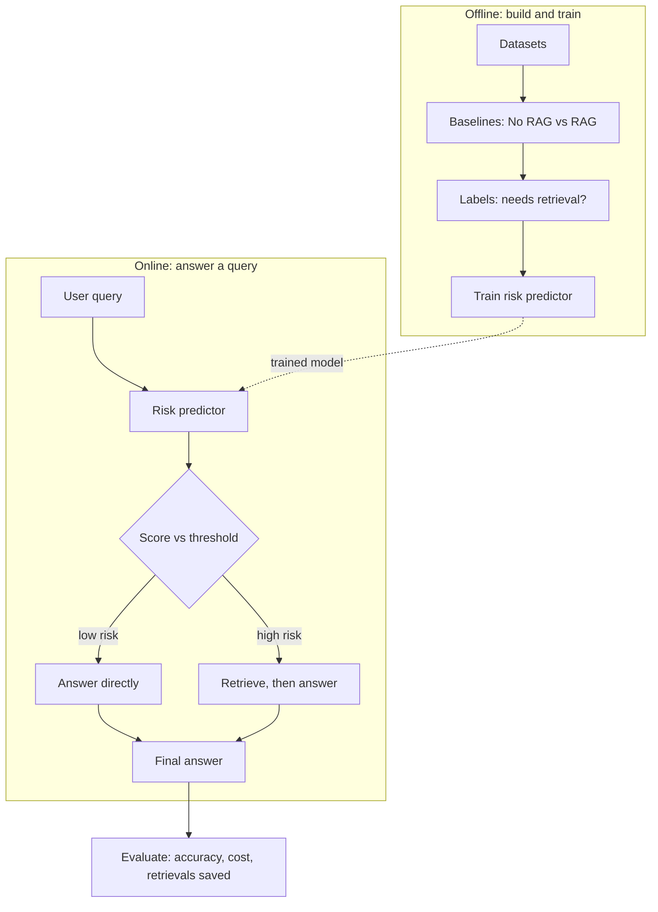

# MahoRAG

**Cost-Efficient Adaptive Retrieval via Pre-Generation Risk Prediction**

> *Retrieve only when it matters.*

MahoRAG looks at a user's query **before** the LLM answers, estimates how likely a hallucination is, and picks the cheapest safe strategy: answer directly, or retrieve evidence first.

> **Status:** Work in progress. Results below are placeholders until experiments are finished.

---

## Why the name?

Named after Mahoraga from *Jujutsu Kaisen*, which adapts to any technique it faces. MahoRAG adapts its strategy to each query in the same way.

---

## The problem

- LLMs sometimes make up facts (hallucinations).
- Retrieval (RAG) reduces this, but retrieving on **every** query is slow and costly.
- Most queries do not need retrieval.

## Research question

> Can a cheap pre-generation predictor route queries to the right safeguard and match always-retrieve accuracy at lower cost?

We do **not** claim to eliminate hallucinations. The goal is to reduce their probability while controlling latency and token cost.

---

## How it works



**Labels** come from the model's real mistakes: a query is marked "needs retrieval" if the no-RAG answer is wrong and the RAG answer is right.

---

## Risk predictors (simple to advanced)

| Stage | Method |
|---|---|
| 1. Rules | Regex, NER, date words, numbers, multi-hop cues |
| 2. Classical ML | Logistic regression / XGBoost on features + embeddings |
| 3. Neural | Fine-tuned DeBERTa |
| Baseline | "Ask the LLM how risky this is" |

Scores are calibrated (e.g. isotonic regression) so that 0.8 means about 80%.

---

## Baselines to beat

- Never retrieve
- Always retrieve
- Random routing at the same retrieval rate
- LLM self-reported risk

## Metrics

- Accuracy (Exact Match, F1, LLM judge)
- Retrieval rate, latency, token cost
- Unneeded retrievals (retrieved but not required)
- Cost vs accuracy curve (threshold sweep)
- Feature ablations and cross-dataset generalization

---

## Datasets

| Dataset | Tests |
|---|---|
| PopQA, SimpleQA | Entity rarity, factual accuracy |
| FreshQA | Time-sensitive questions |
| HotpotQA, MuSiQue | Multi-hop reasoning |
| AmbigQA | Ambiguity |
| TruthfulQA, HaluEval | General hallucination |

Train the predictor on some datasets and test on others to avoid learning dataset quirks.

---

## Tech stack

| Part | Tools |
|---|---|
| Language | Python |
| LLM | Llama 3.1 8B or Qwen2.5 7B via vLLM |
| Retrieval | BM25 (Pyserini) or bge/e5 + FAISS |
| Features | spaCy, regex, wordfreq |
| ML | scikit-learn, XGBoost, PyTorch, Hugging Face Transformers |
| Tracking | Weights & Biases or MLflow |
| Serving | FastAPI, MCP Python SDK |
| Deploy | Docker |

---

## Project structure

```
maho-rag/
├── configs/          # datasets, models, router settings
├── data/             # raw, processed, retrieval_index, labels
├── src/maho_rag/
│   ├── data/         # dataset loading and splits
│   ├── llm/          # vLLM client, prompts
│   ├── retrieval/    # index building and search
│   ├── baselines/    # no_rag, always_rag
│   ├── labeling/     # judge, make_labels
│   ├── features/     # rule-based features
│   ├── predictor/    # rule_based, classical, neural, calibrate
│   ├── router/       # router, threshold_sweep
│   ├── evaluation/   # metrics, cost, ablations, plots
│   └── serving/      # api.py (FastAPI), mcp_server.py
├── experiments/      # run_baselines, run_router, run_ablations
├── notebooks/
├── results/
├── tests/
└── docker/
```

---

## Getting started

```bash
git clone https://github.com/<your-username>/maho-rag.git
cd maho-rag
python -m venv .venv && source .venv/bin/activate
pip install -e .
cp .env.example .env   # add your keys
```

```bash
make baselines   # run no-RAG and always-RAG
make labels      # build "needs retrieval" labels
make train       # train the risk predictor
make eval        # threshold sweep and plots
```

*(Commands will be filled in as the code is written.)*

---

## MCP integration (demo)

MahoRAG will expose a tool that AI clients such as Claude can call:

```
assess_reliability_risk(query)
```

Example response:

```json
{
  "risk": 0.87,
  "risk_factors": ["temporal", "numerical", "multi_hop"],
  "recommended_strategy": ["retrieve_external_evidence", "verify_numerical_claims"]
}
```

**Limitations:** the client decides whether to call the tool and whether to follow the advice. The server sees only the query text, not model internals. All research experiments therefore run through our own API, and MCP is used as a demo.

---

## Results

| Method | Accuracy | Retrieval rate | Avg. latency | Avg. cost |
|---|---|---|---|---|
| Never retrieve | TBD | 0% | TBD | TBD |
| Always retrieve | TBD | 100% | TBD | TBD |
| Random routing | TBD | TBD | TBD | TBD |
| MahoRAG (rules) | TBD | TBD | TBD | TBD |
| MahoRAG (ML) | TBD | TBD | TBD | TBD |
| MahoRAG (neural) | TBD | TBD | TBD | TBD |

**Success criterion:** accuracy within about 1 to 2 points of always-retrieve, with clearly fewer retrievals. A negative result (query text alone cannot predict risk) is also a valid finding.

---

## Roadmap

- [ ] Datasets, baselines, labels
- [ ] Rule-based and classical ML predictors
- [ ] Router, threshold sweep, ablations
- [ ] Neural predictor and cross-dataset tests
- [ ] FastAPI service and MCP demo
- [ ] Write-up

---

## Related Work

MahoRAG builds on prior work in adaptive retrieval, selective retrieval, and cost-aware LLM routing:

- **Adaptive-RAG (2024):** Dynamically selects between no retrieval, single-step retrieval, and iterative retrieval based on query complexity.
- **Self-RAG (2023):** Learns when to retrieve and critiques generated responses through self-reflection.
- **DRAGIN (2024):** Performs dynamic retrieval during generation based on the model's information needs.
- **When Not to Trust Language Models (2023):** Shows that retrieval is particularly useful for less-popular factual knowledge and motivates selective retrieval.
- **RouteLLM (2024):** Uses lightweight routing to balance LLM quality and inference cost.
- **FrugalGPT (2023):** Explores cost-efficient LLM routing and cascading strategies.
- **Language Models (Mostly) Know What They Know (2022):** Studies whether models can estimate their own uncertainty and knowledge limitations.

### Our Focus

Existing work shows that retrieval is not equally useful for every query. MahoRAG investigates whether a **lightweight pre-generation predictor can estimate the marginal benefit of retrieval**, allowing an LLM to approach always-RAG accuracy while performing fewer unnecessary retrieval operations.

---

## License

MIT-use it as you want

## Author

Bharadwaj · [LinkedIn](#) · [GitHub](#)
